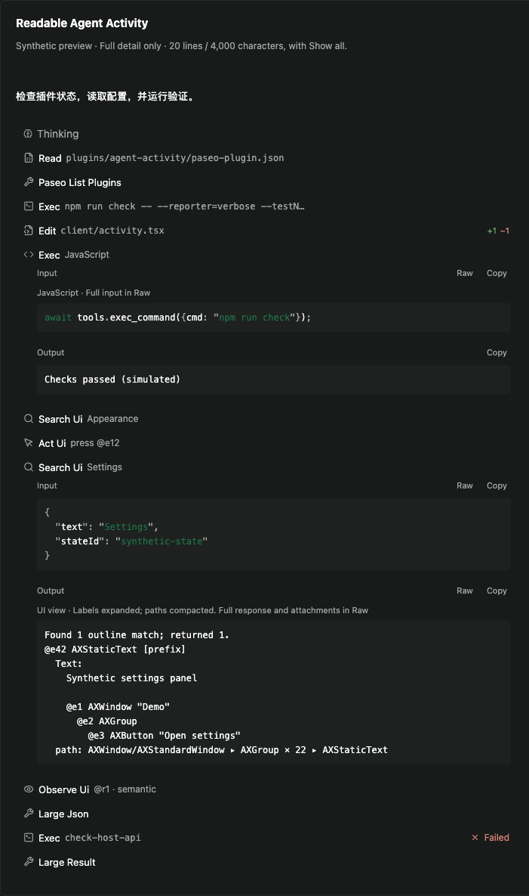

# Readable Agent Activity

A quiet, readable view of tool calls and reasoning for [Paseo](https://paseo.sh).
Forked from Matt Cowger's [Colorful Agent Activity](https://github.com/mcowger/paseo-plugins/tree/91058be73840ae11b130b6bb7d34b07652462217/colorful-agent-activity).

> **Experimental beta · Full detail only · verified with Paseo 0.8.0 on macOS.**
> Summary mode is **not supported**. Set Tool call display to **Full detail on every connected client** before enabling this plugin, and disable it before switching to Summary. The public SDK cannot detect that setting or preserve native Summary groups. Do not enable alongside another tool/reasoning timeline replacement.

## What changes

- Quiet theme-aware rows, specialized tool icons and short, single-line summaries. JavaScript source stays in the body rather than filling the header.
- Formatted JSON and highlighted literal JavaScript inputs for known code tools. JSON strings retain their original numbers, duplicate keys, escapes and key order.
- Tool-result text is extracted from typed `content` envelopes; image/resource data is not loaded automatically.
- UI search labels with escaped newlines become readable, indented text. Repeated accessibility paths become `AXWindow ▸ AXGroup × 22 ▸ AXStaticText`. This is an explicitly labeled **UI view**, not a lossless replacement for Raw.
- **20 newline-separated lines / 4,000 UTF-16 characters** per section by default. **Show all / Show less**, without pagination. Wrapped text may occupy more than 20 visual lines.
- **Raw** retains the complete received response, including metadata and attachments. **Copy** copies the complete selected representation, not just the preview: derived text in Readable, full response in Raw.
- Tools and Thinking start collapsed. Streaming, completion and theme changes never open them automatically.
- Native messages, approvals and composer remain unchanged. No separate palette or server entry.



[Light theme](images/readable-light.png) · [Compact layout](images/readable-compact.png)

Screenshots use synthetic data and production components in a React Native Web preview, **not screenshots of a connected Paseo app or on-device mobile tests**.

## Install

Plugins are **trusted, unsandboxed code**. This plugin's runtime is presentation-only and does not request files, processes or network access, but installation runs npm dependency installation and checks. Review the source before enabling plugins on your daemon.

1. Use Paseo app and daemon **0.8.0**. Choose **Full detail** in the app's Tool call display setting on all connected clients.
2. Enable plugins in Paseo Settings only if you accept the trust model. Disable any other tool/reasoning timeline replacement, including the upstream Colorful Agent Activity.
3. Install the pinned beta on your intended daemon:

```sh
paseo plugin add geoqiao/paseo-readable-activity --ref v0.1.0-beta.1 --host <your-host>
paseo plugin ls --host <your-host>
```

Replace `<your-host>` with your host address; for the standard local daemon it is `127.0.0.1:6767`. Installation enables the plugin. Confirm `readable-agent-activity` is `running`.

Before returning to Summary:

```sh
paseo plugin disable readable-agent-activity --host <your-host>
```

No daemon restart is needed. Tags pin a version rather than tracking a branch. This is a GitHub release; the package is intentionally not published to npm.

## Limits worth knowing

- **Full detail only.** The manifest range `>=0.8.0 <0.9.0` describes the API boundary, not proof that every 0.8 release or display mode works. See [compatibility](docs/compatibility.md).
- Desktop collapsed row pitch is 32px with the verified host gap. Compact mode keeps 44px touch targets, so it is deliberately less dense.
- Formatting and highlighting have 100,000-character work limits; serialized transport-envelope decoding is capped at 1,000,000 characters. Unrecognized or oversized text stays literal. UI label decoding is one layer only, never a global backslash replacement.
- **Show all, full Raw and Copy can be expensive** for enormous responses. Preview limits do not bound host storage, serialization or clipboard work.
- Expansion state survives updates while mounted, not virtual-list unmounts or reconnects.
- Native iOS/Android and a full reconnect/enable-disable matrix have not been tested. Browser compact checks are not mobile-device verification.

## Develop

Requires Node.js 22 or newer and npm. The plugin owns its dependencies and lockfile; it does not depend on a parent monorepo.

```sh
npm ci --ignore-scripts --legacy-peer-deps --no-audit --no-fund
npm run check
```

Typecheck, lint and **187 tests** cover fidelity, malformed/large data, icons/summaries, highlighting, copying races, user-controlled folding, streaming, themes and real pinned host projection functions. [Verification and gaps](docs/verification.md).

For a local checkout, run checks before installing/reloading on an explicit target host. Do not auto-enable an existing disabled installation.

## Credits and catalog

MIT; original Copyright (c) 2026 Matt Cowger retained. See [LICENSE](LICENSE) and exact [upstream provenance](UPSTREAM.md). Vendored Paseo test fixtures retain their separate Apache-2.0 license.

paseo.cafe is an independent community directory. [Submission instructions and prepared registry entry](docs/catalog.md); publication here does not itself mean the plugin is listed.
